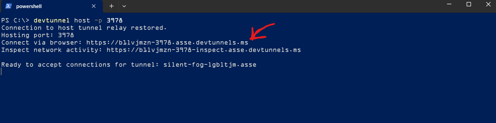

# Dev Tunnel

Dev tunnels allow developers to securely share local web services across the internet, enabling you to connect your local development environment with cloud services. 

We need dev tunnels to expose the local agent running on your machine to the internet so that it can be reached by Microsoft 365 services. This is required for the agent to receive messages from Microsoft 365 services.

Dev tunnels are for ad hoc testing and development, not for production workloads. [Additional Docs](https://learn.microsoft.com/en-us/azure/developer/dev-tunnels/overview)

## Step 1: Install dev tunnel

Entire installation instructions can be found [here](https://learn.microsoft.com/en-us/azure/developer/dev-tunnels/get-started).

```
winget install Microsoft.devtunnel
```

## Step 2: Login to dev tunnel

```
devtunnel user login
```

NOTE: Login with the same account that you are using for Microsoft 365 test account. 

## Step 3: Create a dev tunnel on your local machine

For the samples for this lab, we will be creating a dev tunnel for the local agent, by default it runs on port 3978. You can create a dev tunnel for this port using the following command:

```
devtunnel host -p 3978 --allow-anonymous
```

Expected output (example):



``` 
Connection to host tunnel relay restored.
Hosting port: 3978
Connect via browser: https://b1lvjmzn-3978.asse.devtunnels.ms
Inspect network activity: https://b1lvjmzn-3978-inspect.asse.devtunnels.ms
```

This means the `localhost:3978` is now exposed to the internet via the dev tunnel URL `https://b1lvjmzn-3978.asse.devtunnels.ms`. You can use this URL to connect to your local agent from Microsoft 365 services.

For agentic user we will append `/api/messages` to the dev tunnel URL to form the callback URL. For example, if your dev tunnel URL is `https://b1lvjmzn-3978.asse.devtunnels.ms`, then your callback URL will be `https://b1lvjmzn-3978.asse.devtunnels.ms/api/messages`.

So for the above example, the callback URL will be:

```
https://b1lvjmzn-3978.asse.devtunnels.ms/api/messages
```