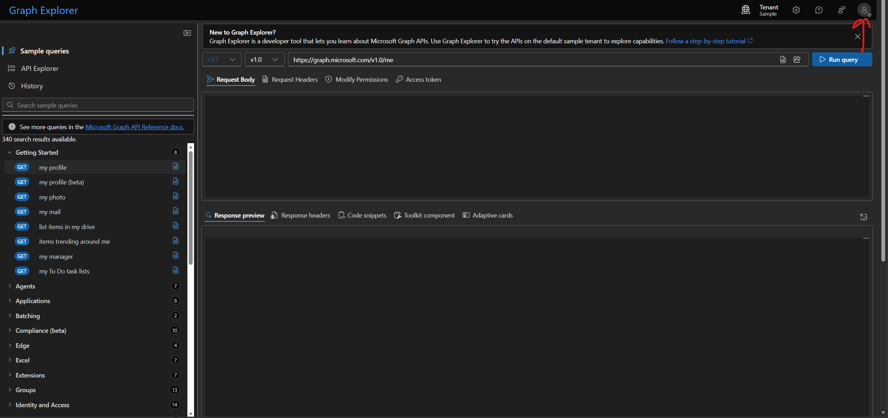
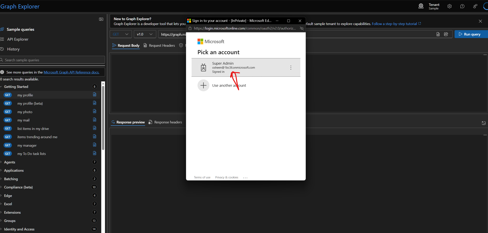
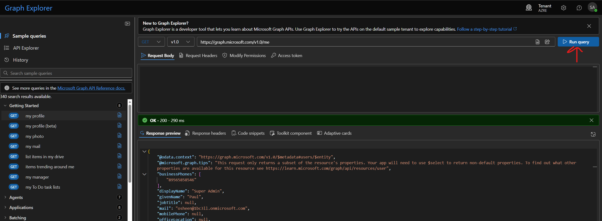
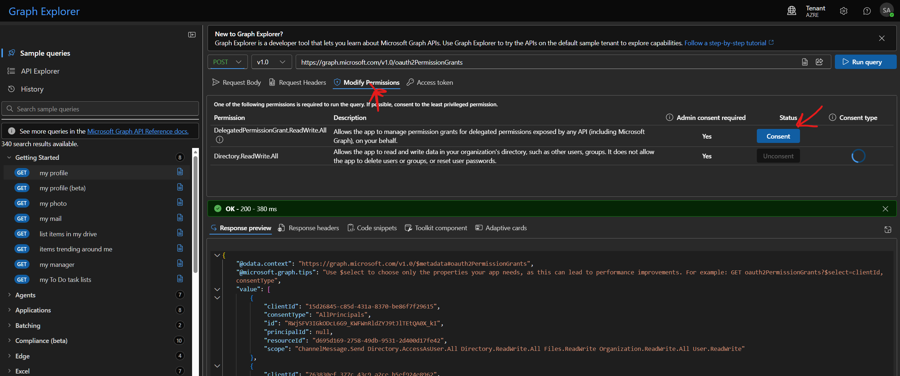
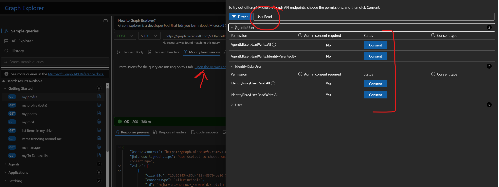
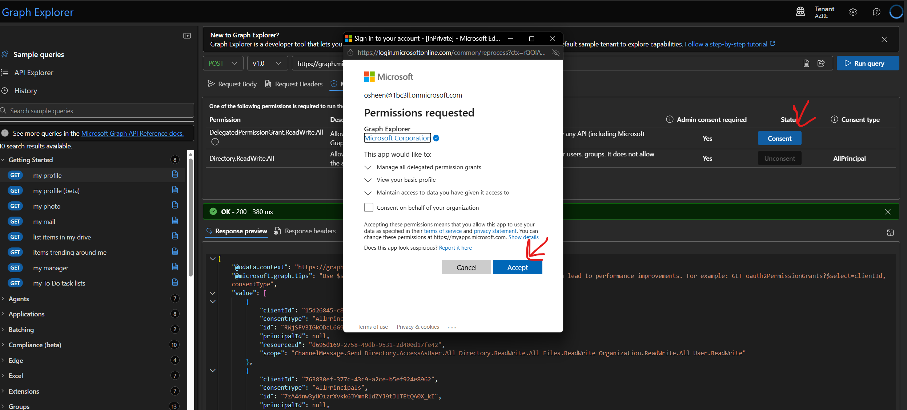

# Graph Explorer Troubleshooting

In case this is your first time using graph explorer, please refer to the below wiki for troubleshooting.

Graph Explorer can be accessed at [aka.ms/ge](https://aka.ms/ge)

## Sign in to Graph Explorer

On the top right corner of the page, click **Sign in to Graph Explorer**. Sign in with the Microsoft account you have admin access (or test account)





## Making Graph calls

You can make calls by entering the request URL in the request bar and clicking **Run Query**. You can also use the **Sample Queries** tab to explore some of the available queries.



## Modify permissions

While going thru the labs, when the documentation states something like:

```
"The caller needs the `Application.Read.All` permission"
``` 

This means that the Graph Explorer needs to have the `Application.Read.All` permission granted. You can do this by clicking on the **Modify permissions** tab and selecting the required permission.

For most of the APIs graph explorer will automatically suggest the required permissions.



In some cases you may need to manually add the required permission. You can do this by clicking on **open  permissions panel** and searching for the required permission.



On clicking **Add permissions** you will be prompted to grant admin consent for the permission. You can do this by clicking on **Consent**.



