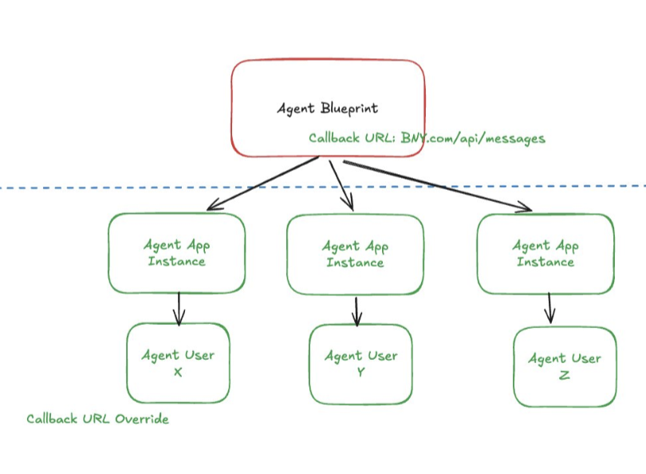

# Lab 01 - Create a Digital Worker

⏰ Estimated time: 40 min

## Overview

This lab will walk you through the steps to create a discoverable Digital Worker (DW) in Microsoft 365. A Digital Worker is a specialized type of agentic user that can be discovered and interacted with across Microsoft 365 applications, such as Teams and Viva Engage.

## What is an agentic user?
An agentic user is the runtime identity that appears in your organization. Agentic users are a specialized subtype of user identity designed specifically for agents. Documentation can be found here: [Agentic User](https://learn.microsoft.com/en-us/microsoft-agent-365/developer/identity#agent-user) and [Agent Identity](https://learn.microsoft.com/en-us/entra/agent-id/agent-identities)

An agentic user is backed by an agent identity, which is backed by an agent blueprint. The agent blueprint contains the endpoint where Teams messages (and other events) will be sent. One agent blueprint can be used to create multiple agent identities and agentic users.



## Prerequisites

Use a test account where you are a Global Administrator or have the ability to create users, assign licenses, and grant permissions. The following are required:

- Access to the [Microsoft Entra admin center](https://entra.microsoft.com/)
- Access to the [Microsoft Teams Developer Portal](https://dev.teams.microsoft.com/)
- Access to [Microsoft Graph Explorer](https://developer.microsoft.com/graph/graph-explorer) If you are using Graph Explorer for the first time, please refer to the [Graph Explorer Troubleshooting](graphExplorerHelp/Readme.md) guide for help signing in and granting permissions.
- Permissions to create agent identities, users, and OAuth permission grants
- An available Microsoft 365 E3 (or any M365) license


## 1. Create an Agent Blueprint

1. Open [Agent Blueprints in the Microsoft Entra admin center](https://entra.microsoft.com/#view/Microsoft_AAD_RegisteredApps/AllAgents.MenuView/~/allAgentBlueprints).
2. Create an agent blueprint by giving its name, once created click `Go to blueprint` this will load the blueprint details.
3. Save the following values for later:
   - Agent Blueprint `appId`
   - Agent Blueprint `principalObjectId`
4. Create a client secret for authentication and store it securely.
   - On the same Agent Blueprint details page, goto `Credentials` > `Client secrets` > `New client secret`, generate a secret and save the `value` securely, it will be used in the next step to configure the agent service.
   - Make sure to use `Client secrets` for `Credentials` and **NOT** `Federated Credentials` for these samples
5. [Skip this step if the sample code is not set up] Open the blueprint in the Teams Developer Portal, replacing `{appId}` with the saved agent application ID:

   ```text
   https://dev.teams.microsoft.com/tools/agent-blueprint/{appId}
   ```
   Set the agent endpoint URL, this is the service on which the agent is hosted `{host}/api/messages`. (For this, refer to the sample's readme. You can use ngrok to expose your local service to the internet and set this later in the developer portal, in case you dont have the sample set up skip this for now and come back to it later).
6. Note down your `tenantId`. (Tenant Id can be found here: [Entra Portal Tenant Id](https://entra.microsoft.com/#view/Microsoft_AAD_IAM/TenantOverview.ReactView))


From this step, you should have the following values saved for later use:
- Agent Blueprint `appId`
- Agent Blueprint `principalObjectId`
- Agent Blueprint `clientSecret`
- Tenant Id `tenantId`

## 2. Get the SMBA resource id

The caller needs the `Application.Read.All` permission. (See [this guide](../../dependencies/graph-explorer/Readme.md#modify-permissions) on granting permissions in graph explorer.)

In Microsoft Graph Explorer, submit the following request **as is**, do not change the id in the URL.

```http
GET https://graph.microsoft.com/v1.0/servicePrincipals(appId='5a807f24-c9de-44ee-a3a7-329e88a00ffc')?$select=id,displayName
```
This should return the `id` for Messaging Bot API Application, save this id, this will be referred as `smbaResourceId` and will be used later.

## 3. Assign the SMBA Permission to the Agent Blueprint

The caller needs the `DelegatedPermissionGrant.ReadWrite.All` permission.

In Microsoft Graph Explorer, submit the following request. Replace `<principalObjectId>` with the value saved in step 1 and the `<smbaResourceId>` saved in step 2.

```http
POST https://graph.microsoft.com/v1.0/oauth2PermissionGrants
Content-Type: application/json
```

```json
{
  "clientId": "<principalObjectId>",
  "consentType": "AllPrincipals",
  "resourceId": "<smbaResourceId>",
  "scope": "AgentData.ReadWrite"
}
```

This should give `201 Success`, we dont have to save anything from the response here.

## 4. Create an Agent Identity

1. Open [Agent Identities in the Microsoft Entra admin center](https://entra.microsoft.com/#view/Microsoft_AAD_RegisteredApps/AllAgents.MenuView/~/allAgentIds).
2. Click Create an agent identity.
3. On the next page, select the agent blueprint from step 1
4. Once the identity is created click `Go to agent identity` this should load the agent identity details page.

Save the `object-id` returned for the new agent identity. this will be referred to as `<agentIdentityObjectId>` in the next step.

## 5. Assign the SMBA Permission to the Agent Identity

The caller needs the `DelegatedPermissionGrant.ReadWrite.All` permission.

In Microsoft Graph Explorer, submit the following request. Replace `<agentIdentityObjectId>` with the value saved in step 4 and the `<smbaResourceId>` saved in step 2.

```http
POST https://graph.microsoft.com/v1.0/oauth2PermissionGrants
Content-Type: application/json
```

```json
{
  "clientId": "<agentIdentityObjectId>",
  "consentType": "AllPrincipals",
  "resourceId": "<smbaResourceId>",
  "scope": "AgentData.ReadWrite"
}
```
This should give `201 Success`, we dont have to save anything from the response here.

## 6. Create an Agentic User

The caller needs `AgentIdUser.ReadWrite.All` permission.

In Microsoft Graph Explorer, submit the following request. Replace the example values as needed and set `agentIdentityObjectId` to the agent identity object ID saved in step 4.

Set the values `displayName` `mailNickname` `userPrincipalName` according to your requirements.

```http
POST https://graph.microsoft.com/beta/users/microsoft.graph.agentUser
Content-Type: application/json
```

```json
{
  "accountEnabled": true,
  "displayName": "Pheonix",
  "mailNickname": "Pheonix",
  "userPrincipalName": "Pheonix@contoso.com",
  "identityParentId": "<agentIdentityObjectId>",
  "usageLocation": "US"
}
```

Save the `id` returned for the new agentic user, this will be reffered to as `<agenticUserId>` in the next step.


## 7. Assign a Microsoft 365 E3 License

The caller needs `LicenseAssignment.ReadWrite.All` permission.

Replace `{agenticUserId}` with the agentic user ID saved in step 6. The following payload uses the Microsoft 365 E3 SKU and should otherwise remain unchanged.

```http
POST https://graph.microsoft.com/v1.0/users/{agenticUserId}/assignLicense
Content-Type: application/json
```

```json
{
  "addLicenses": [
    {
      "skuId": "6fd2c87f-b296-42f0-b197-1e91e994b900",
      "disabledPlans": []
    }
  ],
  "removeLicenses": []
}
```

## 8. Verify the Agentic User in Teams

1. Open Microsoft Teams and locate the newly created agentic user. For the first time you may need to enter the full email e.g. `pheonix@contoso.com`.
2. Send a test message to the agentic user to verify the setup works.

Note: For the message to actually reach your server and for your server to respond back, the server endpoint needs to be configured for this agent blueprint on the Developer Portal.

This step will be done once a sample is up and running on local machine and is tunned to internet via devtunnel (or any other tunnelling software). Follow the next lab to set up a sample and configure the endpoint for the agent blueprint.

