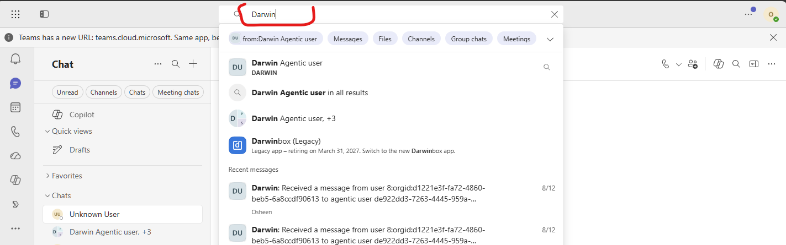
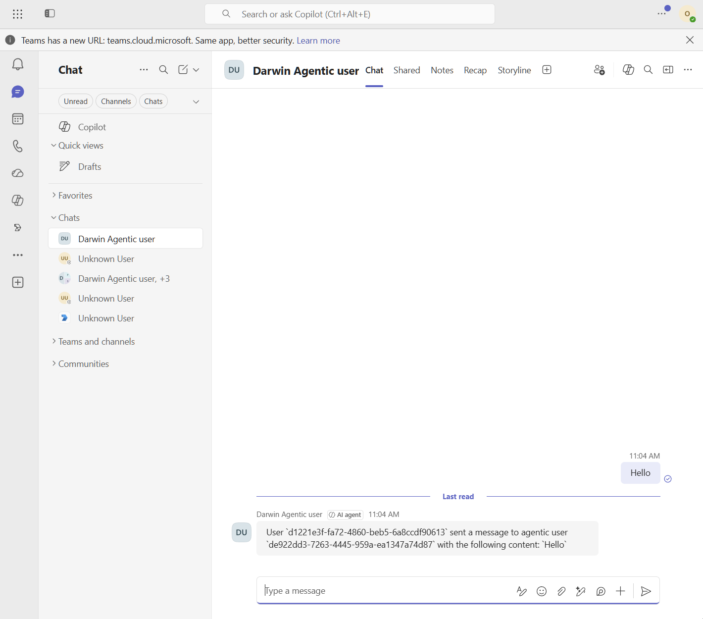
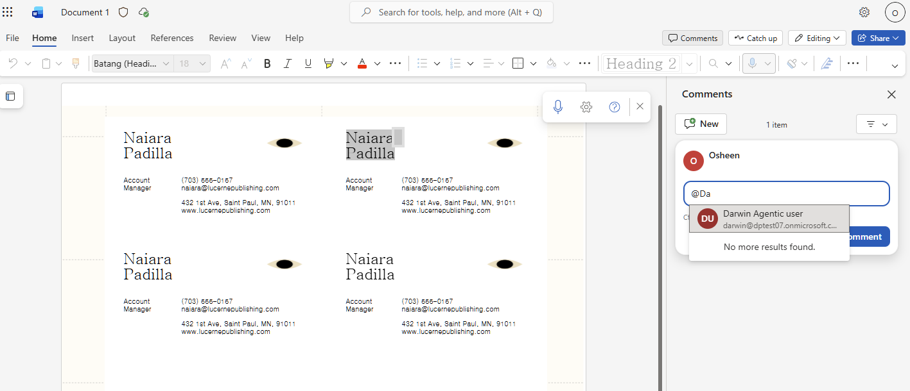
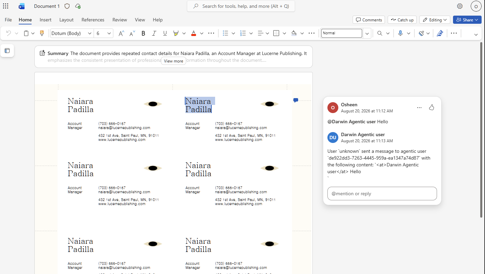

# Lab 02 - Make the Agent Respond

⏰ Estimated time: 40 min

## Overview
In this lab, you will scaffold a basic agent code and configure it to respond to messages sent by users in WXPTO [WXPTO - Word, Excel, PowerPoint, Teams, Outlook]. You will also set up a development tunnel and callback URL to enable communication between the agent and the Microsoft 365 environment.

## Step 1: Clone the Lab code sample

Clone the lab code sample from the repository to your local development environment. This will provide you with the necessary files and structure to build and test your agent.

### Code Explanation:

`Program.cs`

```
teams.OnMessage(async (context, cancellationToken) =>
{
    string response = agent.GetResponse(context.Activity);
    await context.SendActivityAsync(response, cancellationToken: cancellationToken);
});
```

This code snippet sets up an event handler for incoming messages. When a message is received, it calls the `GetResponse` method of the agent to generate a response based on the activity context. The response is then sent back to the user.

`HelloWorldAgentOrchestrator.cs`

```
  public string GetResponse(Microsoft.Teams.Apps.Schema.MessageActivity activity)
    {
        string fromId = activity.From?.AadObjectId ?? "unknown";
        string agenticUserId = activity.Recipient?.AgenticUserId ?? "unknown";
        string text = activity.Text ?? string.Empty;
        return $"User `{fromId}` sent a message to agentic user `{agenticUserId}` with the following content: `{text}`";
    }
```

This method constructs a response string that includes the sender's ID, the agentic user's ID, and the content of the message. It uses null-coalescing operators to handle cases where certain properties may be null.


## Step 2: Set up appsettings.json


Goto `appsettings.json`, leave the other values as is and configure the following:

```
"AzureAd": {
    "ClientId": "<this is the agent blueprint appId configured in setting up agent blueprint>",
    "TenantId": "<this is the tenant id where this agent blueprint is configured>",
    "ClientCredentials": [
      {
        "SourceType": "ClientSecret",
        "ClientSecret": "<client secret for agent blueprint configured above>"
      }
    ]
}
```

## Step 3: Build and run the agent locally

```powershell
dotnet build; dotnet run --no-build;
```

This should start the server locally and you should see the following message in the console:

```
Build succeeded in 1.3s
info: Microsoft.Teams.Apps.TeamsBotApplication[1]
      Started BotApplication listener for AppID:<id> with Teams.Core version 1.0.8
info: Microsoft.Hosting.Lifetime[14]
      Now listening on: http://localhost:3978
info: Microsoft.Hosting.Lifetime[0]
      Application started. Press Ctrl+C to shut down.
```

This means that the server is running and ready to accept requests locally on `http://localhost:3978`. For it to connect to Microsoft 365, you will need to set up a development tunnel and configure a callback URL pointing to your local server.

## Step 4: Set up the dev tunnel 

Make sure you have the [Microsoft dev-tunnel](./dependencies/dev-tunnel/README.md) installed and configured.

Run the following command to start the tunnel and expose your local server to the internet:

```powershell
 devtunnel host -p 3978 --allow-anonymous
```

This should give you a public URL that you can use as the callback URL for your agent.

```
Connect via browser: https://domain.devtunnels.ms
```

The endpoint to be updated in the developer portal is `https://domain.devtunnels.ms/api/messages` (replace the host with your own dev tunnel host)

Note: Since devtunnel can be slow, the agent may take a few seconds to respond to messages. This latency is caused by the dev tunnel and is not indicative of the agent's performance in production.

## Step 5: Configure the callback URL in the developer portal

In the Microsoft 365 Developer Portal, configure the endpoint.

Open the following URL in your browser: `https://dev.teams.microsoft.com/tools/agent-blueprint/<id>`
`<id>` is the agent blueprint app ID created while setting up the blueprint. (This is the same `ClientId` you configured in `appsettings.json`)

Alternatively, you can go to `https://dev.teams.microsoft.com/tools/agent-blueprint`, which should list all your blueprints. Select the required one.

In Blueprint > goto Configuration > Notification Configuration
- Set `Agent Type` as `API Based`
- Set `Notification Url` as the dev-tunnel endpoint `https://domain.devtunnels.ms/api/messages`


## Step 6: Test the agent in Teams, WXP, and Outlook

### Teams:
Goto `https://teams.microsoft.com` in your browser. 

Search for the agentic user by name or email address in the search bar.



Ping the agentic user should return a response from the agent. You can also send messages to the agent and receive responses.




### Word / Excel / PowerPoint:

Open Word, Excel, or PowerPoint and open any document. While adding comments, you can mention the agentic user by name or email address.



Once mentioned, the agentic user should return a response in the comment thread.




